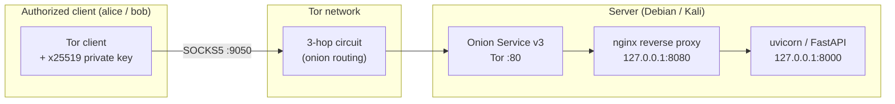
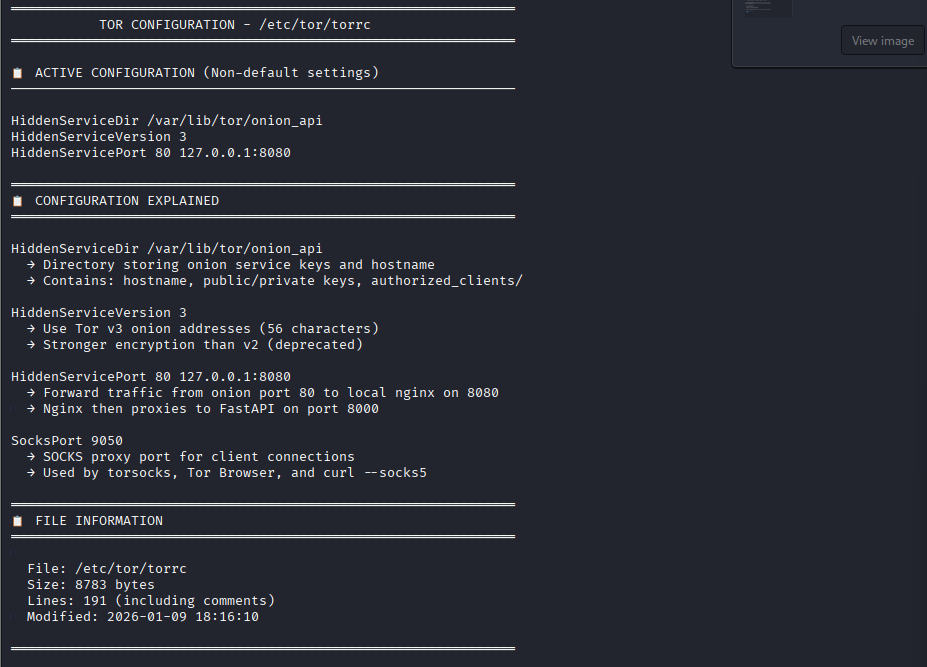
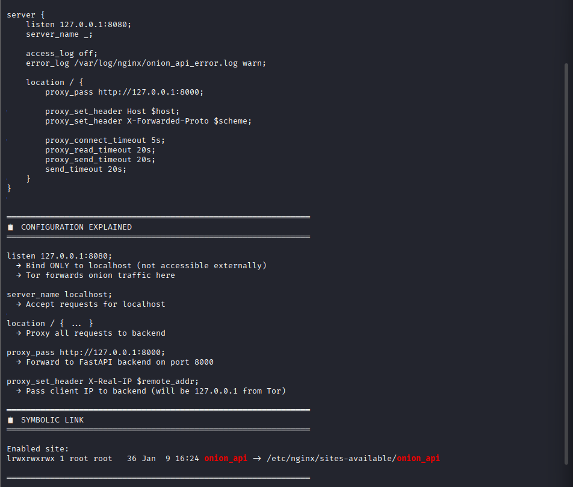
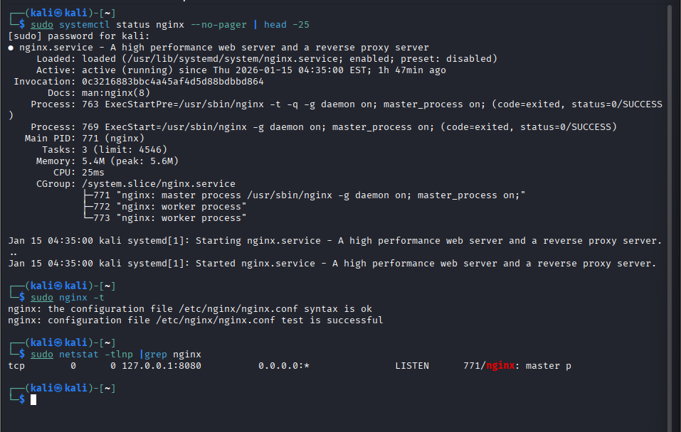
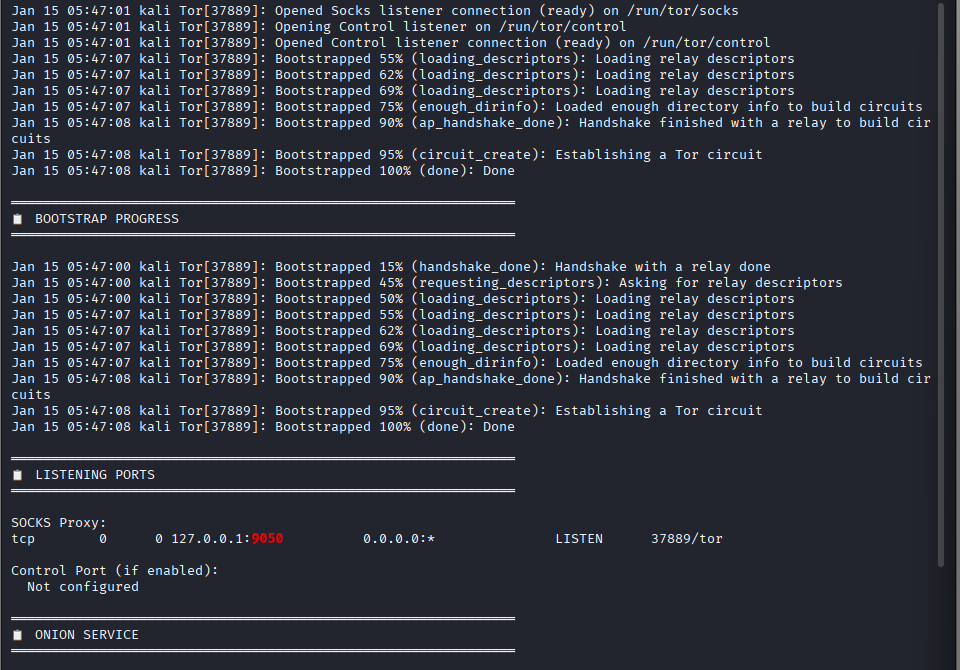
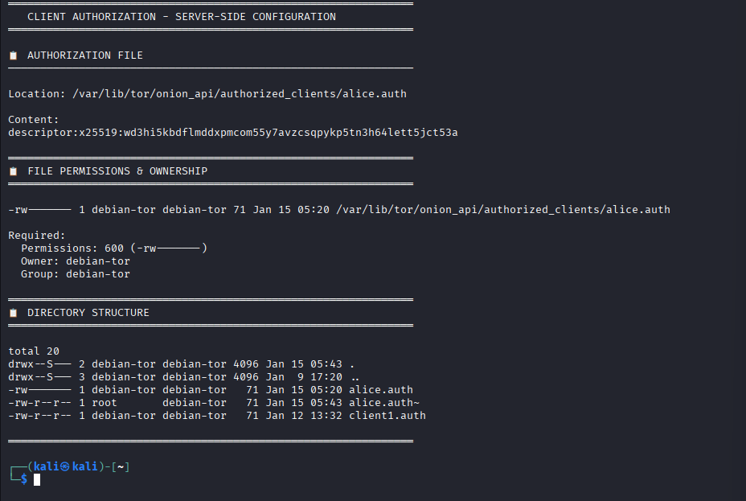
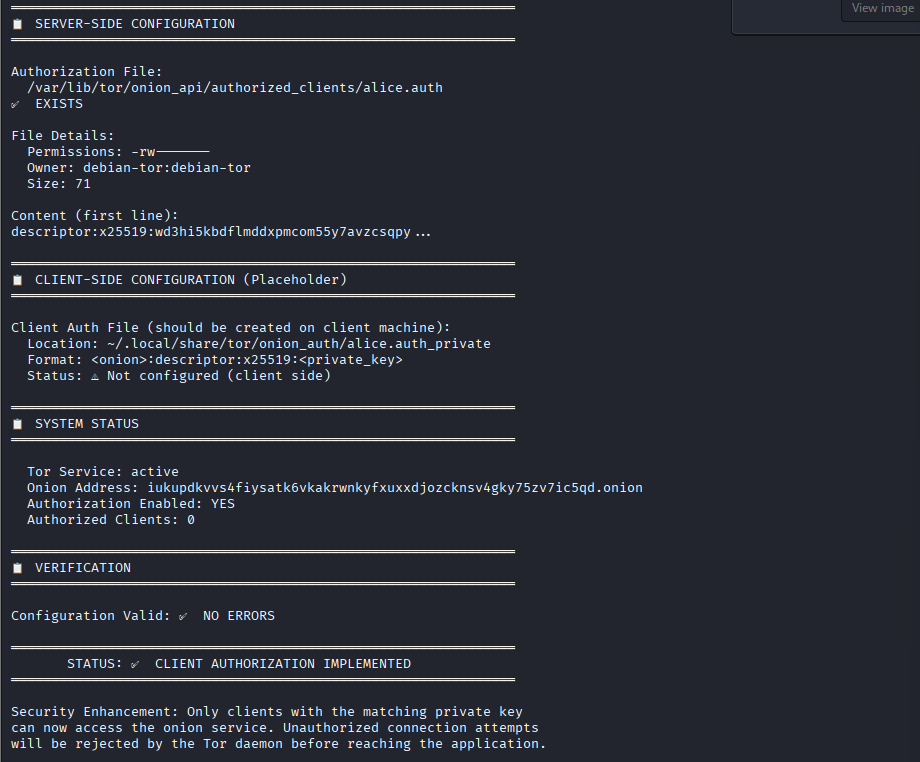

> **Detailed project write-up.** For the quick summary see the [root README](../README.md).

# Tor v3 Onion Service — Private Onion Mailbox API

> A Tor v3 Onion (Hidden) Service that runs a private, client-authorized "Onion
> Mailbox" REST API. Two authorized clients (`alice`, `bob`) exchange messages
> over Tor without ever exposing their IP addresses, or the server's.

This is an academic project I did for a Computer Systems Security course. It's a
working proof of concept, meant to show privacy-by-design and authenticity
through Tor v3 client authorization (x25519). It is not a hardened production
system. I wrote up the limitations in
[`docs/threat-model.md`](threat-model.md), and they're worth reading. Figuring
out what a design does *not* protect was half the point of the assignment.

---

## Architecture

There are four layers between a client request and the application. Each one
binds to `127.0.0.1`, so the only thing exposed to the outside world is Tor.



Request path:

```
Tor :80  ->  nginx 127.0.0.1:8080  ->  uvicorn/FastAPI 127.0.0.1:8000
```

| # | Layer | Role |
|---|-------|------|
| 1 | **Tor network** | 3-hop circuit, onion routing; hides both client and server IPs. |
| 2 | **Onion Service v3** | Ed25519 server keys; 56-char `.onion` address = `Base32(pubkey \|\| checksum \|\| version)`, comparable to ~RSA-3072 strength. |
| 3 | **nginx reverse proxy** | Localhost-only bind, `access_log off`, relaxed timeouts for Tor latency. |
| 4 | **FastAPI application** | In-memory mailbox; no disk persistence. |

If you want the deeper walkthrough (what each component is responsible for, the
exact port chain, the request/response sequences), that's in
[`docs/architecture.md`](architecture.md).

---

## Key features

- **Tor v3 Onion Service.** The server is reachable only as a `.onion`, and its
  real IP is never published.
- **Client authorization (x25519).** You need an authorized private key to even
  reach the service. Each client gets a 256-bit x25519 keypair, and the server
  keeps only the **public** half.
- **nginx reverse proxy.** Localhost-only, logging off, timeouts bumped up to
  cope with Tor's higher round-trip latency.
- **Privacy-by-design.** Storage is in-memory only (deliberate data
  minimization), logging is minimal, and access control is enforced at the Tor
  layer.
- **Wireshark-verified.** The captured traffic is fully encrypted: no plaintext
  HTTP, no readable request lines, no DNS queries, and the real server IP never
  shows up.

---

## Repository structure

```
05-tor-onion-service/
├── app/
│   ├── app.py                     # FastAPI Onion Mailbox API (in-memory)
│   └── requirements.txt           # fastapi, uvicorn, pydantic
├── config/
│   ├── torrc                      # Tor v3 onion service config (placeholders only)
│   ├── nginx/onion_api.conf       # localhost reverse proxy, access_log off
│   └── authorized_clients/README.md   # .auth format + 0600 permission rules
├── scripts/
│   ├── setup.sh                   # end-to-end install (tor + nginx + venv)
│   ├── gen_client_auth.sh         # generate an x25519 client keypair
│   └── run_app.sh                 # run uvicorn bound to 127.0.0.1
├── docker/
│   ├── Dockerfile                 # builds the FastAPI app image
│   └── docker-compose.yml         # api + nginx + tor for local reproducibility
├── examples/
│   ├── mailbox_demo.py            # runnable client demo (local or over Tor)
│   └── requirements.txt           # requests, requests[socks]
├── docs/
│   ├── detailed-overview.md       # this document (full write-up)
│   ├── architecture.md            # deep-dive architecture
│   ├── threat-model.md            # assets, adversaries, honest limitations
│   └── screenshots/               # deployment evidence (6 images)
├── README.md                      # short summary + links
├── LICENSE                        # MIT
└── .gitignore                     # excludes all secrets + build junk
```

---

## How it works — a message from alice to bob

1. **alice** dials the `.onion` through Tor's SOCKS proxy (`127.0.0.1:9050`) and
   presents her x25519 private key for client authorization.
2. Tor builds a circuit to the onion service and authorizes alice at the Tor
   layer. The circuit terminates at the onion service port `:80`, which forwards
   to nginx.
3. nginx (`127.0.0.1:8080`) proxies the request on to FastAPI (`127.0.0.1:8000`).
4. alice sends `POST /send` with `{ "to": "bob", "sender": "alice", "message": "..." }`.
   The API appends the message to bob's in-memory mailbox.
5. Later, **bob** dials the same onion service with *his* key and calls
   `GET /inbox/bob` (add `?pop=1` to read and clear). He gets alice's message.
   Neither one ever learned the other's IP, or the server's.

---

## Getting started

### Prerequisites

- Debian / Ubuntu / Kali Linux
- `tor`, `nginx`, `python3` (`python3-venv`, `python3-pip`)
- For the client demo: Python 3 with `requests` (and `requests[socks]` for Tor)

### Bare-metal deployment

```bash
# 1) Install tor + nginx, deploy configs, create the onion service, build the venv
sudo scripts/setup.sh

# 2) Run the FastAPI backend (localhost only)
scripts/run_app.sh
```

`setup.sh` prints the generated `.onion` address the first time it starts. That
address, and the private keys, stay on the server and are never committed (see
[`.gitignore`](../.gitignore)).

### Local reproduction with Docker

There's a Compose stack (`api` + `nginx` + `tor`) if you want to experiment
locally:

```bash
docker compose -f docker/docker-compose.yml up --build
```

The stack comes up with no extra setup. The Compose-specific nginx/torrc
overrides don't contain any secrets, so they're committed alongside the compose
file. This path is only for local reproducibility. Real keys and the `.onion`
address are generated at runtime inside the `tor_data` volume and never baked
into an image. The inline notes in
[`docker/docker-compose.yml`](../docker/docker-compose.yml) cover the
upstream-naming and key-generation details.

---

## Client authorization

Access control happens at the Tor layer, before a request ever reaches the app.
A client can only open a circuit to the onion service if its **public** key is
registered on the server.

Add a client:

```bash
scripts/gen_client_auth.sh alice
```

This produces two files:

| File | Key | Where it goes |
|------|-----|---------------|
| `alice.auth` | **public** | Server: `<HiddenServiceDir>/authorized_clients/alice.auth`, `chmod 600` |
| `alice.auth_private` | **private** | Client machine only — **never shared or committed** |

The server-side `.auth` file holds the public key only, in this format:

```
descriptor:x25519:<BASE32_PUBLIC_KEY>
```

The tor daemon insists these files are owned by `debian-tor` with mode `0600`,
and it refuses to start if they're wrong. Details are in
[`config/authorized_clients/README.md`](../config/authorized_clients/README.md).

> **No real keys or `.onion` address are checked into this repository.** Every
> config and doc uses the placeholder `<your-onion-address>`.

---

## Security & privacy

I captured traffic with **Wireshark** while messages were being exchanged. What I
saw:

- **Everything on the wire is encrypted** — just unreadable ciphertext.
- **No plaintext HTTP** — no readable `Host`, `GET`, or `POST` lines.
- **Source and destination are only `127.0.0.1`** — the real server IP never
  appears.
- **No DNS queries** — `.onion` addresses resolve inside Tor's distributed hash
  table, not through DNS, so there's nothing to leak.

So the design protects the server's location/IP, the confidentiality of traffic
in transit, and access control (through v3 client authorization). What it doesn't
protect is written up plainly below and in the threat model.

---

## Performance

Anonymity isn't free, and you can measure the cost. I compared round-trip latency
for a direct localhost call against the same call routed through the Tor circuit:

| Path | Latency (approx.) | Relative |
|------|-------------------|----------|
| Direct (localhost) | ~5 ms | 1× |
| Over Tor (3-hop circuit) | ~800–1200 ms | ~200× slower |

That ~200× slowdown is what the 3-hop onion-routed circuit costs you. For a
low-throughput, privacy-critical mailbox, I think it's a fine trade.

---

## Threat model (summary)

The design protects the **server's anonymity**, **transport confidentiality**,
and **access control** at the Tor layer. It does not authenticate the
self-declared `sender` field at the application layer, it doesn't sign or encrypt
messages end-to-end above Tor, and it doesn't provide durability. The full
analysis (assets, adversaries, what is and isn't protected, trust assumptions,
residual risks, and future work) is in
[`docs/threat-model.md`](threat-model.md).

---

## Screenshots

Deployment and verification evidence (`docs/screenshots/`):

| | |
|---|---|
|  | **Tor configuration** — `torrc` onion service v3 directives. |
|  | **nginx config** — localhost bind, access log off, relaxed timeouts. |
|  | **nginx service** — reverse proxy running and validated. |
|  | **Tor bootstrap** — daemon bootstrapping and publishing the onion service. |
|  | **Client-auth server config** — authorized client public key installed. |
|  | **Final authorization** — authorized client reaching the service. |

---

## Tech stack

- **Tor** — v3 Onion Service (Ed25519 identity), v3 Client Authorization (x25519)
- **nginx** — reverse proxy (localhost-only)
- **FastAPI** + **uvicorn** — the Onion Mailbox REST API
- **pydantic** — request models
- **Wireshark** — traffic capture / security verification
- **Docker** + **Docker Compose** — local reproducibility
- **Debian / Kali Linux** — deployment platform

---

## References

- Tor Project — [Onion Services (v3) technical overview](https://community.torproject.org/onion-services/)
- Tor Project — [Client Authorization for v3 onion services](https://community.torproject.org/onion-services/advanced/client-auth/)
- Tor v3 onion service protocol — [`rend-spec-v3` specification](https://spec.torproject.org/rend-spec-v3)
- R. Dingledine, N. Mathewson, P. Syverson — *Tor: The Second-Generation Onion Router*, USENIX Security, 2004.
- D. J. Bernstein — *Curve25519: New Diffie-Hellman Speed Records* (x25519), PKC, 2006.
- A. Cavoukian — *Privacy by Design: The 7 Foundational Principles*, 2009.
- S. Josefsson, I. Liusvaara — [RFC 8032: Edwards-Curve Digital Signature Algorithm (EdDSA)](https://www.rfc-editor.org/rfc/rfc8032), 2017.
- [FastAPI documentation](https://fastapi.tiangolo.com/)
- [nginx documentation](https://nginx.org/en/docs/)

---

## Author

**Panagiotis Stamatis** — GitHub [@panagiotistamatis](https://github.com/panagiotistamatis)

Computer Systems Security — university project.

## License

Released under the [MIT License](../LICENSE).
